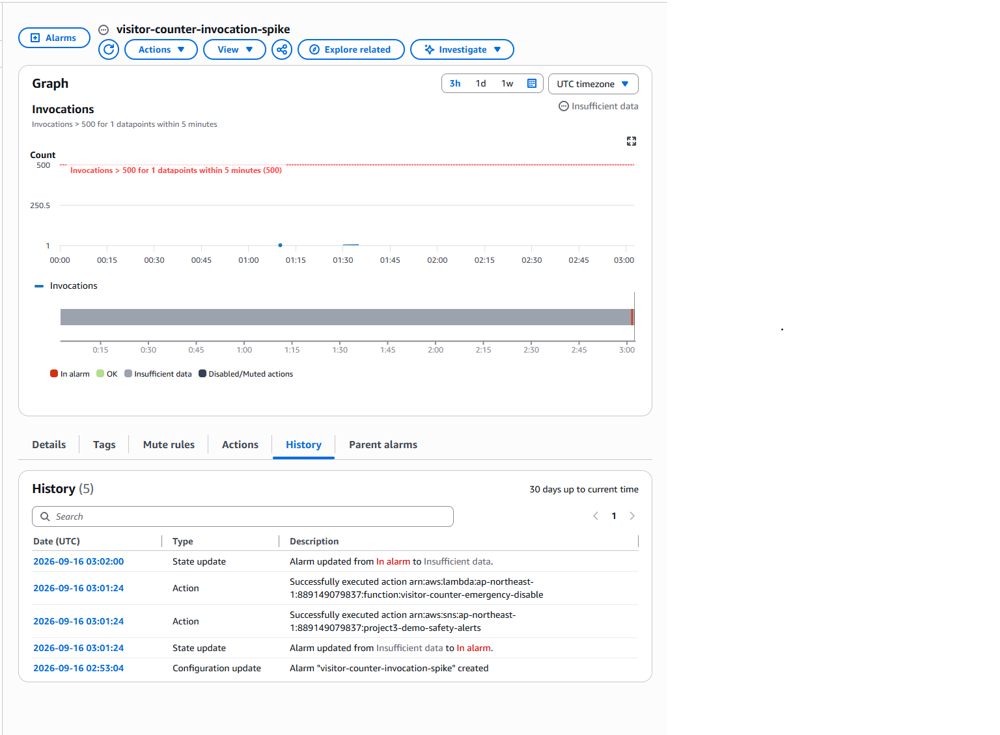
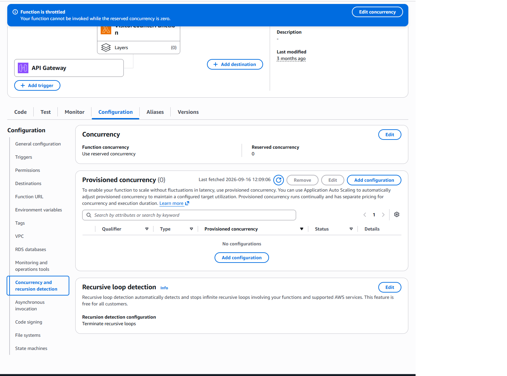

# Visitor counter backend

The visitor counter in the portfolio site footer is a small serverless backend:

    Browser  ->  API Gateway (POST /visit)  ->  Lambda  ->  DynamoDB

The Lambda hashes the visitor's source IP with a salt held in a Lambda
environment variable and stores only the hash. The raw IP is never written.

Full request flow and data model are documented in the root README.

## Operational safety

This endpoint is public and unauthenticated, and unlike the order workflow demo
it fires on **every page load** rather than on a deliberate click. It therefore
has the same two-layer protection: a rate limit that reduces traffic reaching
the backend, and an alarm-driven kill switch that contains elevated invocations.

### Request throttling

API Gateway route throttling on the `$default` stage:

    Rate limit:  5 requests per second
    Burst limit: 10 requests

Normal browsing generates one request per page load. Throttling reduces the
requests reaching Lambda and the resulting DynamoDB writes. These limits are
best-effort targets, not guaranteed request ceilings or a spending cap. See the
[AWS throttling documentation](https://docs.aws.amazon.com/apigateway/latest/developerguide/http-api-throttling.html).

### Monitoring and containment

    Alarm:      visitor-counter-invocation-spike
    Metric:     AWS/Lambda Invocations, FunctionName = VisitorCounterFunction
    Statistic:  Sum
    Period:     300 seconds
    Threshold:  greater than 500
    Evaluation: 1 of 1 datapoints

    Action 1:   SNS notification to project3-demo-safety-alerts
    Action 2:   invoke visitor-counter-emergency-disable

`visitor-counter-emergency-disable` calls `PutFunctionConcurrency` with
`ReservedConcurrentExecutions=0` on `VisitorCounterFunction`, which stops it
being invoked at all until concurrency is manually removed.

The [exported containment source](src/visitor-counter-emergency-disable/lambda_function.py)
hardcodes this target; it does not select a function from the incoming event.
Its [configuration metadata](src/visitor-counter-emergency-disable/function-config.json)
records an empty environment-variable name list and contains no environment
variable values.

### Why two separate containment Lambdas

The order workflow has its own kill switch, `project3-emergency-disable-demo`.
Rather than generalise one Lambda to handle both endpoints, each public entry
point has its own single-purpose function, and each execution role is scoped to
`lambda:PutFunctionConcurrency` on exactly one function ARN:

| Lambda | Target | Permitted resource |
|---|---|---|
| `project3-emergency-disable-demo` | `project3-order-publisher` | that function ARN only |
| `visitor-counter-emergency-disable` | `VisitorCounterFunction` | that function ARN only |

A shared Lambda would need a role covering both functions, which would mean a
bug or an unexpected event could disable the wrong endpoint. With separate
roles, neither function *can* affect the other — the constraint is enforced by
IAM rather than by application logic. The cost is a small amount of duplicated
code, which is an acceptable trade for a smaller blast radius.

## Containment test

The full path was tested end to end rather than assumed to work.

1. `visitor-counter-invocation-spike` was driven into ALARM.
2. CloudWatch alarm history recorded the configured action executing
   successfully.
3. `visitor-counter-emergency-disable` was invoked.
4. `VisitorCounterFunction` reserved concurrency was set to 0.
5. The Lambda console reported the function throttled and not invocable while
   reserved concurrency was zero.
6. Reserved concurrency was removed, returning the function to unreserved
   account concurrency.
7. The live site was reloaded and the visitor counter confirmed working.





### Recovery

Containment is deliberately not self-clearing — the function stays disabled
until a human looks at why it fired:

```bash
aws lambda delete-function-concurrency \
  --function-name VisitorCounterFunction \
  --region ap-northeast-1
```
