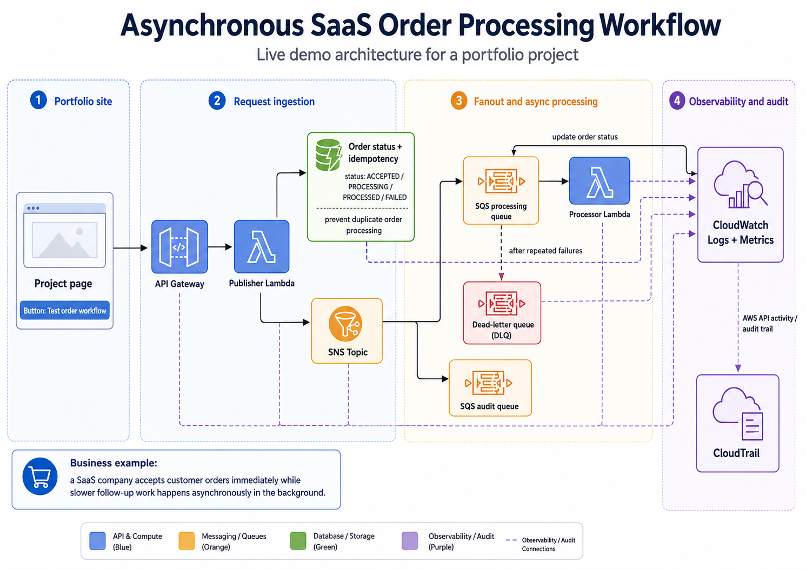
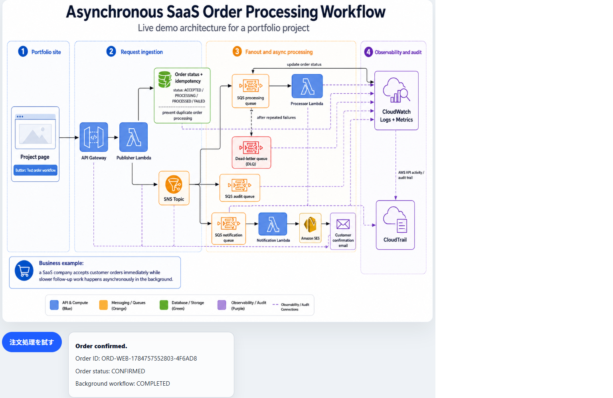
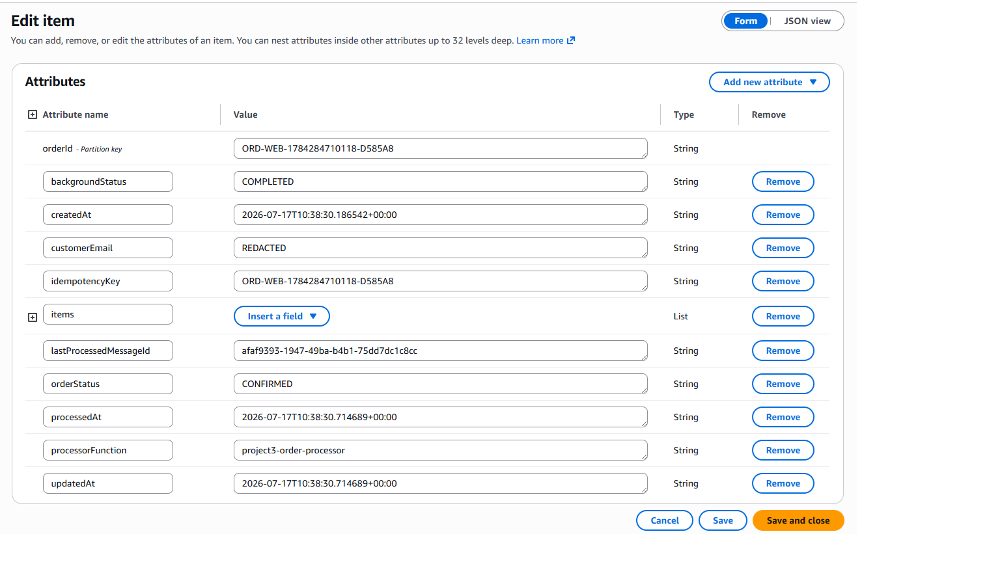
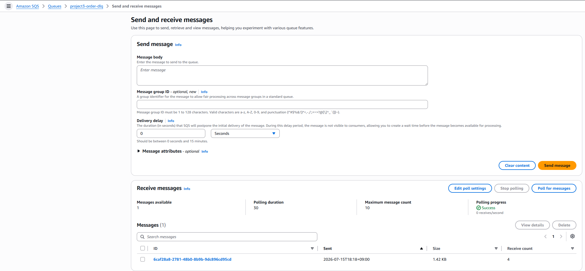
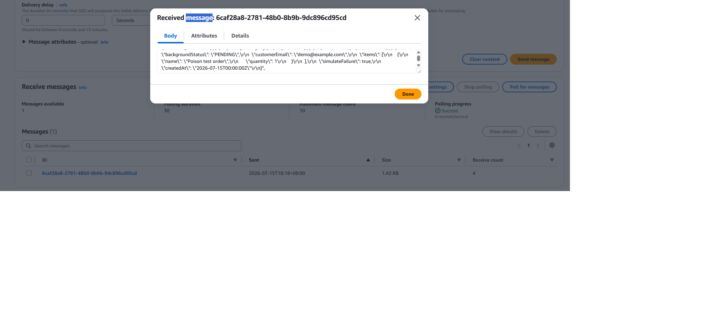
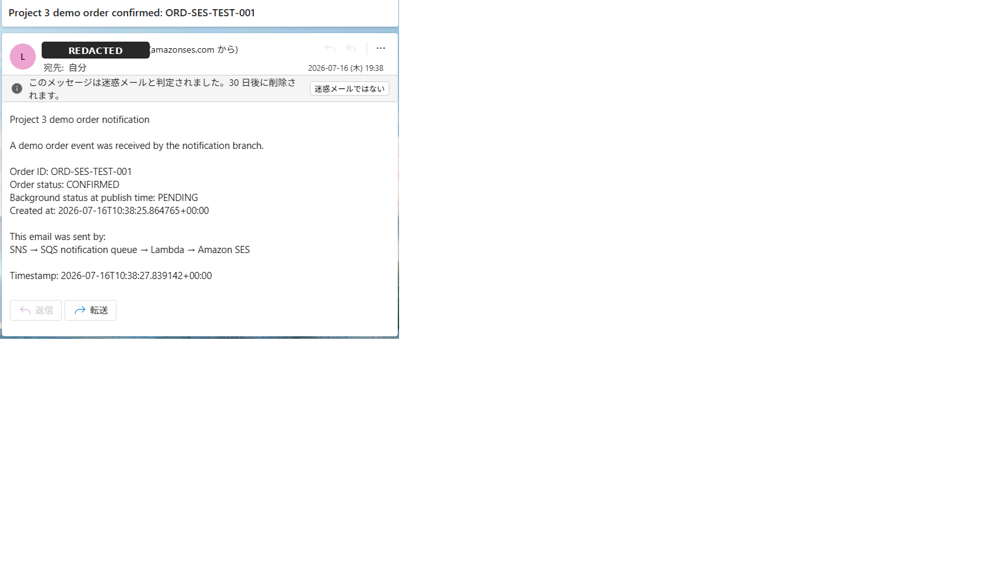
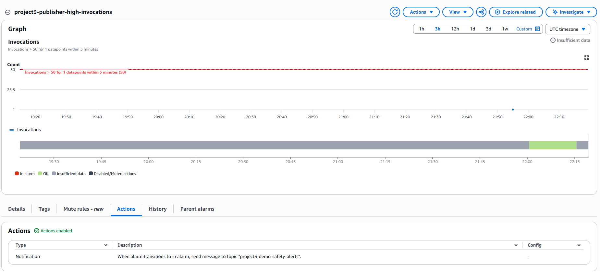
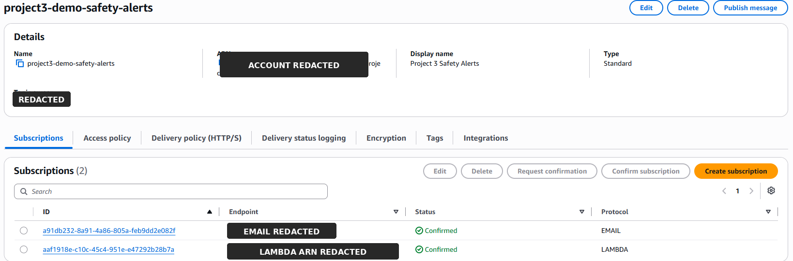
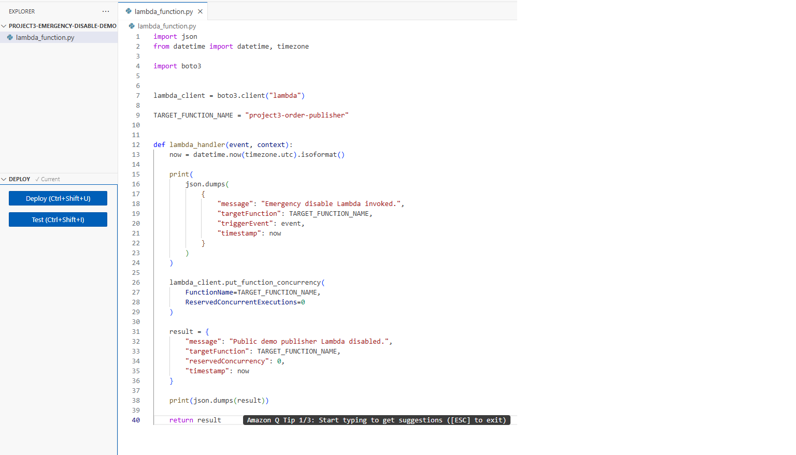

# 非同期 SaaS 注文処理ワークフロー

[English version](readme-en.md)

このプロジェクトは、AWS 上で構築したイベント駆動型の注文処理ワークフローです。

公開ポートフォリオページから API Gateway 経由でデモ注文を作成します。バックエンドでは、注文状態を DynamoDB に保存し、注文イベントを SNS に発行し、SQS と Lambda によって非同期処理を行い、更新された注文状態をフロントエンドへ返します。

目的は、実務で使われるクラウド運用パターンを示すことです。ユーザー向けのリクエストは素早く受け付け、時間のかかる後続処理は非同期ワークフローに移し、状態を追跡し、失敗時にはデッドレターキューで処理し、公開エンドポイントには監視と自動的な封じ込めを追加しています。

ライブデモ:

https://sebastianhoglund.cloud/projects/event-driven-order-processing-workflow/index.html

## アーキテクチャ

通常の注文処理フロー:

    CloudFront ポートフォリオページ
      -> API Gateway HTTP API
      -> Publisher Lambda
      -> DynamoDB 注文レコード
      -> SNS 注文イベントトピック
      -> SQS 処理キュー
      -> Processor Lambda
      -> DynamoDB 状態更新

注文状態の確認フロー:

    CloudFront ポートフォリオページ
      -> API Gateway HTTP API
      -> Status Lambda
      -> DynamoDB 状態読み取り

追加ブランチと運用制御:

    SNS 注文イベントトピック
      -> SQS 監査キュー

    SNS 注文イベントトピック
      -> SQS 通知キュー
      -> Notifier Lambda
      -> Amazon SES
      -> 検証済みメールアドレス
      -> 検証後に無効化

    SQS 処理キュー
      -> 再試行
      -> デッドレターキュー

    CloudWatch アラーム
      -> SNS 安全通知トピック
      -> メール通知
      -> 緊急停止 Lambda
      -> 公開 Publisher Lambda の予約済み同時実行数を 0 に設定

## 使用した AWS サービス

- Amazon API Gateway
- AWS Lambda
- Amazon DynamoDB
- Amazon SNS
- Amazon SQS
- Amazon SES
- Amazon CloudWatch
- AWS CloudTrail
- AWS IAM
- Amazon CloudFront

## デモの動作

公開プロジェクトページには、デモ注文を作成するテストボタンがあります。

ボタンをクリックすると、次の処理が行われます。

1. ブラウザが API Gateway に POST /orders リクエストを送信します。
2. API Gateway が project3-order-publisher を呼び出します。
3. Publisher Lambda が backgroundStatus = PENDING の注文アイテムを DynamoDB に書き込みます。
4. Publisher Lambda が ORDER_CONFIRMED イベントを SNS に発行します。
5. SNS がイベントを複数の SQS キューへ配信します。
6. 処理キューが project3-order-processor を呼び出します。
7. Processor Lambda が DynamoDB アイテムを backgroundStatus = COMPLETED に更新します。
8. フロントエンドが API Gateway 経由で GET /orders/{orderId} をポーリングします。
9. Status Lambda が DynamoDB から現在の注文状態を読み取ります。
10. ページにバックグラウンドワークフローの完了状態が表示されます。

## 主なリソース

| リソース | 名前 |
|---|---|
| DynamoDB テーブル | project3-orders |
| SNS トピック | project3-order-events |
| 処理キュー | project3-order-processing-queue |
| 監査キュー | project3-order-audit-queue |
| 通知キュー | project3-order-notification-queue |
| デッドレターキュー | project3-order-dlq |
| Publisher Lambda | project3-order-publisher |
| Processor Lambda | project3-order-processor |
| Status Lambda | project3-order-status |
| Notifier Lambda | project3-order-notifier |
| 緊急停止 Lambda | project3-emergency-disable-demo |
| HTTP API | project3-order-workflow-api |

## 失敗処理

処理キューにはデッドレターキューを設定しています。

Processor Lambda がメッセージ処理に繰り返し失敗した場合、そのメッセージはキューから削除されません。SQS は配信を再試行します。設定された受信回数の上限に達すると、SQS はそのメッセージを project3-order-dlq に移動します。

これは、次のような意図的な poison test message で検証しました。

    {
      "orderId": "ORD-DLQ-TEST-001",
      "simulateFailure": true
    }

Processor Lambda は意図的にエラーを発生させ、メッセージは再試行された後、デッドレターキューへ移動されました。

## 通知ブランチ

Amazon SES を使用した通知ブランチも実装し、検証しました。

    SNS トピック
      -> SQS 通知キュー
      -> Notifier Lambda
      -> Amazon SES
      -> 検証済みメール受信箱

このブランチでは、次のテスト注文についてメール送信に成功しました。

    ORD-SES-TEST-001

検証後、この通知ブランチは公開デモから切り離しました。訪問者がデモボタンをクリックするたびに不要なメールが送信されることを防ぐためです。

最終状態としては、通知パスは実装・検証済みですが、公開トラフィックに対しては有効化していません。

## 運用上の安全対策

このプロジェクトは公開された未認証の API エンドポイントを使用しているため、
独立した 2 つの制御を組み合わせています。ワークフローに到達するトラフィックを
抑えるレート制限と、呼び出し数が増加した場合に封じ込めるアラーム連動の
キルスイッチです。

### リクエストのスロットリング

API Gateway の `$default` ステージで、ルートスロットリングを次の値に設定しています。

    レート制限: 1 秒あたり 2 リクエスト
    バースト制限: 5 リクエスト

デモボタンを押す訪問者のリクエストは数秒に 1 回程度であるため、通常利用を
許容しつつ、スクリプトによる濫用を制限する値です。スロットリングを第一の防御策と
したのは、設定に費用がかからず、アラームの発動前に後続の処理量を抑えられるため
です。受け付けるリクエストを制限することで、Lambda の実行回数、SNS の発行、
SQS のメッセージ、DynamoDB の書き込みをまとめて抑制できます。API Gateway の
スロットリングはベストエフォートであり、リクエスト数や支出の厳密な上限を保証
するものではありません。[AWS のスロットリングに関する説明](https://docs.aws.amazon.com/apigateway/latest/developerguide/http-api-throttling.html)を参照してください。

AWS WAF も検討しましたが、採用しませんでした。より柔軟なルール設定が可能な
一方で月額費用が発生し、想定される脅威が標的型攻撃ではなくループを回す訪問者
程度であるポートフォリオのデモには見合わないと判断しました。

このスロットリングは AWS CLI から手動で設定したものであり、このリポジトリの
Infrastructure as Code の管理対象には含まれていません。

### 監視と封じ込め

スロットリングはレートを制限しますが、継続時間は制限しません。そのため、
Publisher Lambda は CloudWatch アラームでも監視しています。

安全制御:

    メトリクス: project3-order-publisher Invocations
    しきい値: 5 分間で 50 回を超える呼び出し
    アクション 1: メール通知を送信
    アクション 2: 緊急停止 Lambda を呼び出す

緊急停止 Lambda は PutFunctionConcurrency を呼び出し、project3-order-publisher の予約済み同時実行数を 0 に設定します。

これにより、異常なトラフィックが検出された場合、公開注文作成関数を即座にスロットリングできます。復旧時には、予約済み同時実行数の設定を削除または変更することで手動で再有効化できます。

この制御はシンプルですが、公開クラウドエントリーポイントには監視、通知、封じ込めが必要であるという運用上の考慮を示しています。

## IAM 設計

各 Lambda 関数には、その役割に必要な権限だけを持つ専用の実行ロールを使用しています。

例:

- Publisher Lambda は注文テーブルへの書き込みと SNS への発行ができます。
- Processor Lambda は処理キューからの読み取りと DynamoDB の更新ができます。
- Status Lambda は DynamoDB からの読み取りができます。
- Notifier Lambda は通知キューからの読み取りと SES によるメール送信ができます。
- 緊急停止 Lambda は公開 Publisher Lambda の同時実行数設定だけを変更できます。

これにより、各関数の責任範囲に合わせて権限を絞っています。

## コストとクリーンアップ

このプロジェクトは、非常に低コストで維持できるように設計しています。

- Lambda の利用量は最小限です。
- DynamoDB には小さなテストアイテムのみを保存しています。
- SQS と SNS のトラフィックは非常に少量です。
- SES は一度検証し、その後公開デモから切り離しました。
- CloudWatch は運用可視性のために使用しています。
- AWS Budgets はコストレベルの安全対策として有効です。

公開デモは有効なままですが、SES 通知ブランチは不要なメール送信を防ぐため無効化しています。

## エビデンス

### ライブワークフローの完了

ライブポートフォリオページからAPI Gateway経由で注文を作成し、非同期ワークフローが完了した結果を表示しています。

### DynamoDBの注文状態

保存された注文レコードには、確定済みの注文状態、完了したバックグラウンド処理、冪等性キー、処理Lambda、処理時刻が記録されています。

### デッドレターキューの検証

意図的に失敗させたテストメッセージは複数回再試行された後、設定済みのデッドレターキューへ移動しました。

テストペイロードでは、処理失敗を発生させる設定を明示的に有効化しています。

### SES通知ブランチ

通知ブランチを公開デモから切り離す前に、SNS、SQS、Lambda、Amazon SESを通じて確認メールが正常に配信されることを検証しました。

### 公開デモの安全対策

CloudWatchアラームは、公開Publisher Lambdaの呼び出し回数を監視します。

アラームは、メール通知と緊急Lambdaを購読させたSNS安全通知トピックへメッセージを発行します。

緊急Lambdaは、公開Publisher Lambdaの予約済み同時実行数を0に設定してデモ入口を無効化します。

