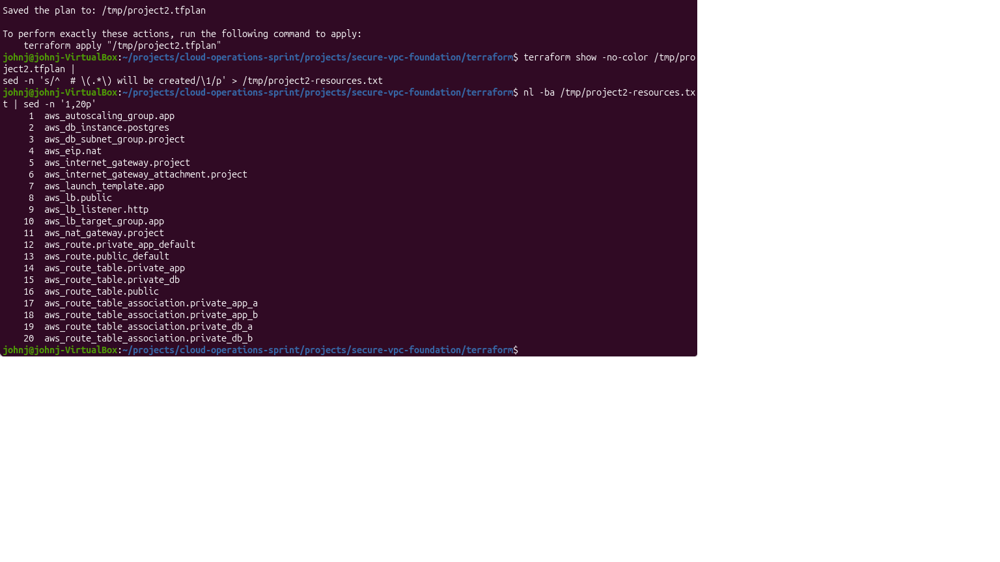
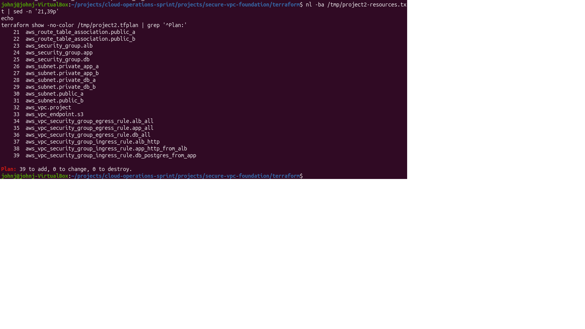
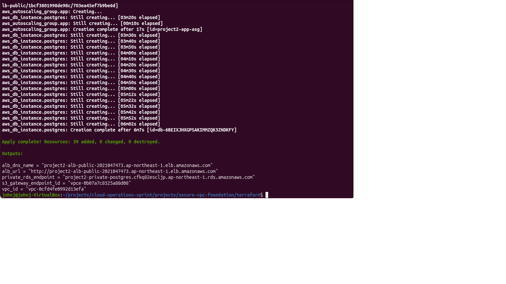
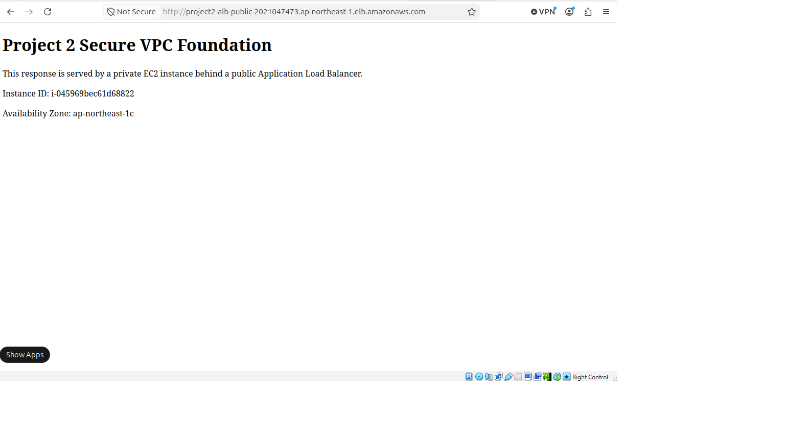
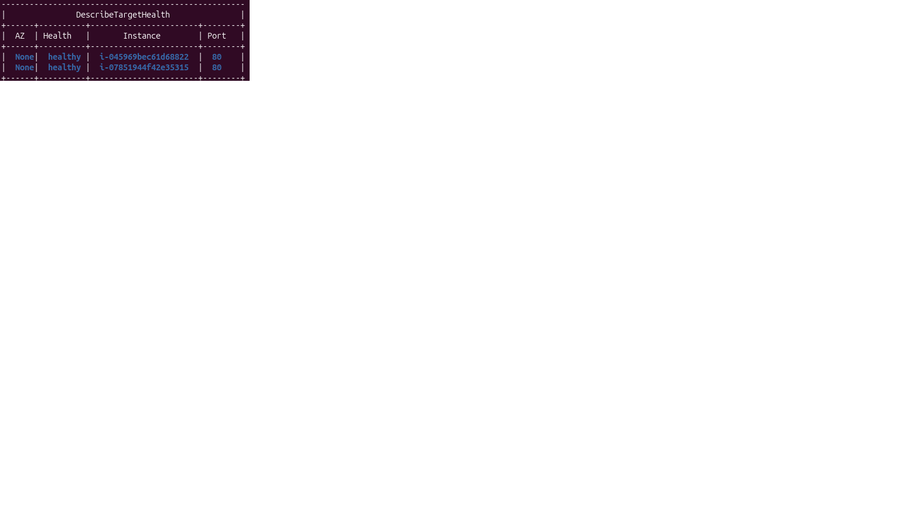
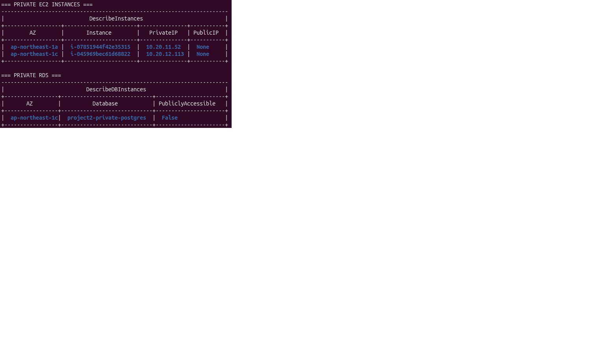
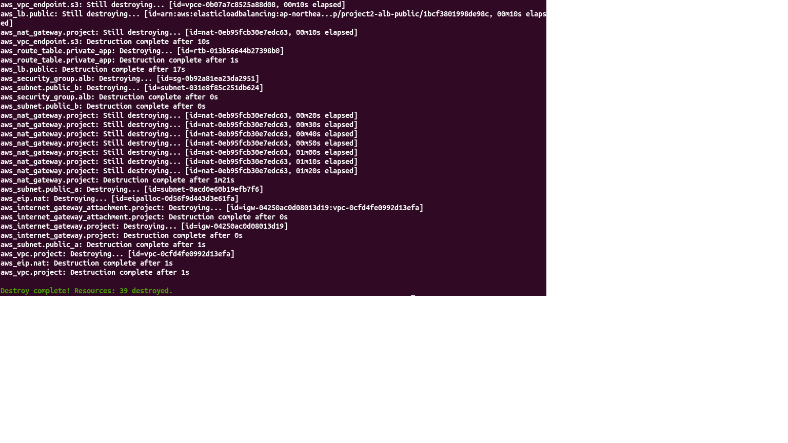

# セキュアな VPC 基盤

このプロジェクトでは、小規模 Web アプリケーション向けの安全な AWS ネットワーク基盤を構築しました。アプリケーションはパブリックな Application Load Balancer を通じてインターネットからアクセスできますが、アプリケーションサーバーとデータベースはプライベートサブネットに分離されています。

最初に AWS コンソールで手動構築を行い、アーキテクチャの検証、証跡の取得、削除手順の確認を行いました。その後、同じアーキテクチャを CloudFormation と Terraform の両方で再現し、インフラをコードとして反復可能にデプロイ、検証、削除できることを確認しました。

## シナリオ

小規模な会社が、シンプルな Web アプリケーションを AWS へ移行したいとします。

要件は以下の通りです。

* 顧客がインターネットから Web アプリケーションへアクセスできること
* アプリケーションサーバーがパブリックインターネットから直接到達できないこと
* データベースが直接パブリックアクセスから分離されていること
* アプリケーション層が 2 つの Availability Zone にまたがる可用性を持つこと
* インフラを再現可能にすること
* テスト後に課金対象リソースを削除すること

## アーキテクチャ

このラボは東京リージョン（`ap-northeast-1`）で構築しました。

ネットワーク設計:

* VPC: `10.20.0.0/16`
* Application Load Balancer 用のパブリックサブネット
* Auto Scaling Group 内の EC2 インスタンス用プライベートアプリケーションサブネット
* Amazon RDS 用プライベートデータベースサブネット
* パブリック ALB アクセス用 Internet Gateway
* プライベートアプリケーション層からのアウトバウンドインターネットアクセス用 NAT Gateway
* プライベート S3 アクセス用 S3 Gateway Endpoint
* 各層間の通信を制御する Security Group

トラフィックフロー:

```text
Internet
  ↓
Internet Gateway
  ↓
Public Application Load Balancer
  ↓
Private EC2 application instances
  ↓
Private RDS database
```

## 使用した AWS サービス

* Amazon VPC
* Subnets
* Route tables
* Internet Gateway
* NAT Gateway
* Security Groups
* Application Load Balancer
* EC2
* Auto Scaling Group
* Launch Template
* Amazon RDS for PostgreSQL
* DB subnet group
* S3 Gateway Endpoint
* CloudFormation

## セキュリティ設計

パブリックな入口は Application Load Balancer のみです。EC2 アプリケーションインスタンスはプライベートサブネットに配置し、パブリック IPv4 アドレスは使用しませんでした。

Security Group は以下のように設計しました。

* ALB はインターネットからの HTTP トラフィックを受け付ける
* アプリケーション層は ALB の Security Group からの HTTP トラフィックのみを受け付ける
* データベース層はアプリケーション層の Security Group からの PostgreSQL トラフィックのみを受け付ける

RDS データベースはパブリックアクセスを無効化し、プライベート DB subnet group に割り当てました。

## 可用性設計

このアーキテクチャでは 2 つの Availability Zone を使用しました。

アプリケーション層は、プライベートアプリケーションサブネットにまたがる 2 台の EC2 インスタンスを Auto Scaling Group で構成しました。Auto Scaling Group では、インスタンス置換時の可用性を優先するために launch-before-terminate のメンテナンスポリシーを使用しました。

コンソール検証ビルドでは、自動スケーリングポリシーは設定していません。将来的なバージョンでは、アプリケーションのトラフィック要件に応じて target tracking、scheduled scaling、predictive scaling などを追加できます。

## 手動コンソール構築

プロジェクトの第一段階では、AWS コンソールで手動構築を行いました。

この段階では以下を行いました。

* VPC、サブネット、ルートテーブル、Security Group 設計の検証
* ALB がプライベート EC2 インスタンスへトラフィックをルーティングできることの確認
* EC2 インスタンスにパブリック IPv4 アドレスが不要であることの確認
* プライベート RDS データベース層の構成
* 証跡スクリーンショットの取得
* 課金対象 AWS リソースの安全な削除手順の確認

手動構築によって、インフラをコード化する前にアーキテクチャが正しく動作することを確認しました。

## CloudFormation による再現

第二段階では、同じアーキテクチャを CloudFormation で再現しました。

テンプレート:

* [`secure-vpc-foundation-template.yaml`](./template/secure-vpc-foundation-template.yaml)

CloudFormation デプロイにより、VPC、6 つのサブネット、ルートテーブル、Internet Gateway、NAT Gateway、S3 Gateway Endpoint、Security Group、Application Load Balancer、Target Group、Launch Template、Auto Scaling Group、EC2 インスタンス、DB subnet group、プライベート RDS PostgreSQL インスタンスを作成しました。

スタックは正常にデプロイされ、手動コンソール構築と同じ運用確認を行いました。

* ALB URL からテスト Web ページが返ること
* Target Group に 2 つの healthy target が表示されること
* EC2 インスタンスがプライベート IP アドレスのみを持ち、パブリック IPv4 アドレスを持たないこと
* RDS インスタンスの public access が disabled であること
* テスト後に CloudFormation スタックを削除できること
* 削除後に課金対象のプロジェクトリソースが残っていないこと

## Terraform による再現

第三段階では、同じアーキテクチャを Terraform で再構築しました。

Terraform 構成:

- [`terraform/`](./terraform/)
- Terraform CLI 1.15.8
- HashiCorp AWS provider 6.57.1
- AWS リージョンや主要なインフラサイズを変数として定義
- データベースパスワードを ephemeral かつ sensitive な変数として渡し、RDS の write-only password 引数を使用
- Terraform state やローカル作業ファイルを必要に応じて Git の追跡対象外に設定
- `.terraform.lock.hcl` で provider の依存バージョンを記録

ローカルからの Terraform 実行には、長期間有効な IAM user access key ではなく、AWS IAM Identity Center の一時認証情報を使用しました。

確認済みの Terraform plan には 39 個のリソースが含まれていました。





保存した plan を正常に apply しました。



実行時の検証では、パブリック ALB を経由してプライベートアプリケーション層のテストページへアクセスできることを確認しました。



2 台のアプリケーションインスタンスが ALB の healthy target として正常に登録されていることを確認しました。



AWS CLI による確認では、アプリケーションインスタンスがプライベート IP アドレスのみを持ちパブリック IPv4 アドレスを持たないこと、および RDS データベースが public access を許可していないことを確認しました。



検証後、Terraform を使用して環境全体を正常に削除しました。



## 検証

アプリケーションは、パブリック Application Load Balancer の DNS 名を通じて正常にアクセスできました。

ブラウザテストにより、トラフィックがパブリック ALB の背後にあるプライベート EC2 インスタンスへ到達していることを確認しました。また、Target Group には 2 つの healthy target が表示され、ALB がプライベートアプリケーション層へトラフィックをルーティングできることを確認しました。

主要な証跡スクリーンショットは [`evidence/`](./evidence/) フォルダに保存しています。

主な証跡:

* [VPC resource map](./evidence/project2-vpc-resource-map.png)
* [Subnet layout across two Availability Zones](./evidence/project2-subnets.png)
* [Public route table with Internet Gateway route](./evidence/project2-public-route-table-igw.png)
* [Public route table associations with public subnets](./evidence/project2-public-route-table-associations.png)
* [Private application route table with NAT Gateway and S3 Gateway Endpoint routes](./evidence/project2-private-app-route-table-nat-s3-endpoint.png)
* [Application Load Balancer details and HTTP listener](./evidence/project2-alb-public-details.png)
* [ALB security group allowing HTTP from the internet](./evidence/project2-alb-sg-public-http.png)
* [Application security group allowing HTTP from the ALB security group](./evidence/project2-app-sg-source-alb-sg.png)
* [Private EC2 instance with no public IPv4 address](./evidence/project2-private-ec2-instances2.png)
* [RDS configuration with public access disabled](./evidence/project2-rds-private-no-public-access.png)
* [Healthy target group with two registered targets](./evidence/project2-target-group-healthy.png)
* [Auto Scaling Group with desired capacity of two instances](./evidence/project2-auto-scaling-group.png)
* [Launch-before-terminate maintenance policy](./evidence/project2-asg-launch-before-terminating.png)
* [Successful browser test through the ALB](./evidence/project2-alb-browser-success.png)

## クリーンアップ

検証後、すべての課金対象リソースを削除しました。

削除したリソースは以下の通りです。

* Auto Scaling Group と EC2 インスタンス
* Application Load Balancer
* Target Group
* RDS データベース
* 手動構築時に作成された RDS snapshot
* NAT Gateway
* S3 Gateway Endpoint
* Launch Template
* DB subnet group
* Security Groups
* Route tables
* Subnets
* Internet Gateway
* VPC

削除後の確認では、EC2、RDS、VPC、NAT Gateway、Elastic IP、Load Balancer、Target Group、Auto Scaling Group の各画面に `project2` リソースが残っていないことを確認しました。

CloudFormation による infrastructure-as-code 検証後も、スタックを正常に削除しました。追加確認として、NAT Gateway が削除されていること、プロジェクト用 Elastic IP が残っていないこと、RDS インスタンスが削除されていること、EC2 インスタンスが terminated 状態であることを確認しました。

Terraform 環境についても、Terraform を使用して作成、検証、削除を行いました。実行時の証跡を取得した後、最終的な destroy が正常に完了しました。

## 成果

このプロジェクトでは、安全な AWS ネットワーク基盤を設計、検証、文書化、再現、削除できることを示しました。

完成したプロジェクトには、同じアーキテクチャに対する 3 種類の実装が含まれます。

- 証跡スクリーンショット付きの AWS コンソール手動構築
- 反復可能なインフラデプロイ用 CloudFormation テンプレート
- plan、apply、実行時検証、destroy の証跡を含む Terraform 実装

このアーキテクチャは、小規模 Web アプリケーション向けの実用的な基盤です。パブリックな入口を Application Load Balancer のみに限定し、アプリケーション層とデータベース層をプライベートに維持します。
